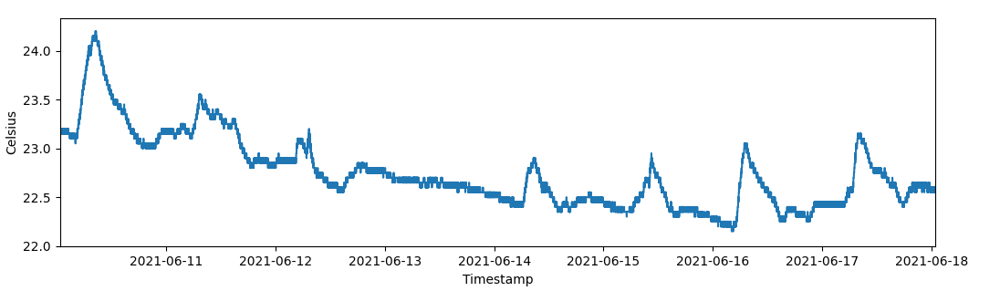

.. _2nd_gen_temperature_sensor_example:

2.Gen Temp Sensor
===================
In this example we will look at how to publish an emulated temperature event for the 2nd generation temperature sensor, then fetch- and plot its event history.

Full Example
------------
The following snippet implements the example. Remember to set the environment variables.

.. code-block:: python

   import os
   from datetime import datetime, timedelta
   import disruptive as dt
   
   # Fetch credentials and device info from environment.
   key_id = os.getenv('DT_SERVICE_ACCOUNT_KEY_ID')
   secret = os.getenv('DT_SERVICE_ACCOUNT_SECRET')
   email = os.getenv('DT_SERVICE_ACCOUNT_EMAIL')
   device_id = os.getenv('DT_DEVICE_ID')
   
   # Authenticate the package using Service Account credentials.
   dt.default_auth = dt.Auth.service_account(key_id, secret, email)
   
   # Create initial values of temperature and time.
   timestamp_now = datetime.utcnow()
   temperature_now = 22.3
   
   # Generate a list of 5 temperature samples, spread evenly in time.
   samples = []
   n_samples = 5
   for i in range(n_samples):
       samples.append(dt.events.TemperatureSample(
           celsius=temperature_now-i,
           timestamp=timestamp_now-timedelta(seconds=int(i*((15*60)/n_samples))),
       ))
   
   # Publish an emulated temperature event with inter-heartbeat samples.
   dt.Emulator.publish_event(
       device_id=os.getenv('DT_DEVICE_ID'),
       project_id=os.getenv('DT_PROJECT_ID'),
       data=dt.events.Temperature(
           celsius=temperature_now,
           timestamp=timestamp_now,
           samples=samples,
       )
   )

   # Fetch a list of all temperature event within the last 7 days.
   events = dt.EventHistory.list_events(
       device_id=os.getenv('DT_DEVICE_ID'),
       project_id=os.getenv('DT_PROJECT_ID'),
       event_types=[dt.events.TEMPERATURE],
       start_time=datetime.utcnow()-timedelta(days=7),
   )
   
   # Create lists into which we will group all samples.
   timestamps = []
   values = []
   
   # Iterate through list of fetched events.
   for event in events:
       # Concatenate samples list to the total group.
       timestamps += [sample.timestamp for sample in event.data.samples]
       values += [sample.celsius for sample in event.data.samples]
   
   # Plot the output. This requires matplotlib to be installed.
   # import matplotlib.pyplot as plt
   # plt.plot(timestamps, values, '.-')
   # plt.show()

Explanation
-----------
Using `Service Account <https://developer.disruptive-technologies.com/docs/service-accounts/introduction-to-service-accounts>`_ credentials, the entire package can be authenticated at once by setting the :code:`dt.default_auth` variable with an Auth :ref:`authentication method <authmethods>`.

.. code-block:: python

   dt.default_auth = dt.Auth.service_account(key_id, secret, email)

Once authenticated, a list of 5 :ref:`TemperatureSample <temperature_sample_event>` events are generated, where the timestamps are evenly spaced assuming a 15 minute heartbeat. For simplicity, the Celsius values are simply a linear increase, but can of course be any value.

.. code-block:: python

   timestamp_now = datetime.utcnow()
   temperature_now = 22.3
   
   samples = []
   n_samples = 5
   for i in range(n_samples):
       samples.append(dt.events.TemperatureSample(
           celsius=temperature_now-i,
           timestamp=timestamp_now-timedelta(seconds=int(i*((15*60)/n_samples))),
       ))

Once the list is ready, publish the event to our emulated sensor. To represent how a real sensor would work, the :ref:`Temperature <temperature_event>` event timestamp- and celsius is set to the first elements of our samples list. However, this is not necessary when emulating events.

.. code-block:: python

   dt.Emulator.publish_event(
       device_id=os.getenv('DT_DEVICE_ID'),
       project_id=os.getenv('DT_PROJECT_ID'),
       data=dt.events.Temperature(
           celsius=temperature_now,
           timestamp=timestamp_now,
           samples=samples,
       )
   )

The event history for the previous 7 days are also fetched. We specify that only :ref:`Temperature <temperature_event>` events should be fetched, ignoring other common ones like :ref:`Touch <touch_event>`- and :ref:`NetworkStatus <networkstatus_event>` events.

.. code-block:: python

   events = dt.EventHistory.list_events(
       device_id=os.getenv('DT_DEVICE_ID'),
       project_id=os.getenv('DT_PROJECT_ID'),
       event_types=[dt.events.TEMPERATURE],
       start_time=datetime.utcnow()-timedelta(days=7),
   )

As we're dealing with a 2nd generation temperature sensor, if we want to examine all data in the event history, all samples must be unpacked. This can be done by iterating through each event, then using list comprehension to isolate the attributes of interest, like timestamp and celsius.

.. code-block:: python

   for event in events:
       timestamps += [sample.timestamp for sample in event.data.samples]
       values += [sample.celsius for sample in event.data.samples]

Once concatenated, the time- and celsius values can be plotted directly.

.. code-block:: python

   plt.plot(timestamps, values, '.-')
   plt.show()
