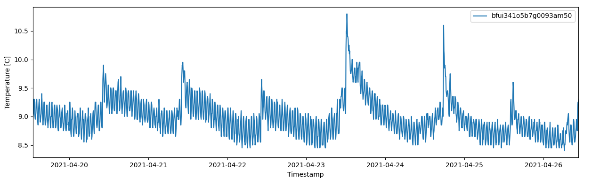

.. _plot_sensor_data_example:

Plot Sensor Data
================
In this example, 7 days of historic temperature events are fetched and plotted for a sensor.

Full Example
------------
The following snippet implements the example. Remember to update user-defined variables.

.. code-block:: python

   from datetime import datetime, timedelta
   import matplotlib.pyplot as plt
   import disruptive as dt
   
   # User-defined variables.
   DEVICE_ID = '<YOUR_DEVICE_ID>'
   PROJECT_ID = '<YOUR_PROJECT_ID>'
   
   # Fetch temperature events for the last 7 days.
   event_history = dt.EventHistory.list_events(
       device_id=DEVICE_ID,
       project_id=PROJECT_ID,
       event_types=[dt.events.TEMPERATURE],
       start_time=datetime.today()-timedelta(days=7),
   )
   
   # Isolate timeaxis and temperature data which can be plotted directly.
   timestamps = [event.data.timestamp for event in event_history]
   temperature = [event.data.celsius for event in event_history]
   
   # Generate a plot using the fetched timeaxis and temperature values.
   plt.plot(timestamps, temperature, '.-')
   plt.xlabel('Timestamp')
   plt.ylabel('Temperature [C]')
   plt.show()

Step-by-Step Explanation
------------------------
The package is authenticated as described in the :ref:`Authentication <client_authentication>` using environment variables.

Once authenticated, the temperature event history can be fetched using the :code:`disruptive.EventHistory.list_events()` resource method. Default timerange is the last 24 hours, but here we provide a `start_time` 7 days ago.

.. code-block:: python

   history = dt.EventHistory.list_events(
       device_id=DEVICE_ID,
       project_id=PROJECT_ID,
       event_types=[dt.events.TEMPERATURE],
       start_time=datetime.today()-timedelta(days=7),
   )

The returned `event_history` variable is list containing the fetched :ref:`Events <client_events>`. Various data can be extracted quickly using simple list comprehension.

.. code-block:: python

   timestamps = [event.data.timestamp for event in event_history]
   temperature = [event.data.celsius for event in event_history]

Finally, provided the `matplotlib` package is installed, the data can be plotted.

.. code-block:: python

   plt.plot(timestamps, temperature, '.-')
   plt.xlabel('Timestamp')
   plt.ylabel('Temperature [C]')
   plt.show()
